# 3D Family Tree Visualization

An interactive 3D family tree visualization that transforms complex genealogical relationships into an immersive, explorable 3D space. Built with React, TypeScript, and Three.js, this application combines real-time 3D graphics with Supabase-powered authentication and fine-grained permission controls.

## Overview

The goal is to create a collaborative family tree platform where multiple family clusters can coexist and interconnect through marriage links, while ensuring each user can only view and edit their immediate family network (1-degree relatives: self, parents, children, siblings, and spouse).

## Building Story

This project was built progressively, with each step unlocking the next capability:

```mermaid
graph TD
    A[Goal: Visualize<br/>family relationships] --> B[Need: Network<br/>structure]
    B --> C[Force-directed<br/>graphs]
    C --> D[Need: 3D<br/>separation]
    D --> E[react-force-<br/>graph-3d]
    
    E --> F[Need: Multi-<br/>user collab]
    F --> G[Supabase +<br/>OAuth]
    G --> H[Need: Privacy<br/>controls]
    H --> I[Node binding<br/>system]
    
    I --> J[Need: Permission<br/>enforcement]
    J --> K[PostgreSQL<br/>RLS policies]
    K --> L[Need: Controlled<br/>onboarding]
    L --> M[Invite token<br/>system]
    
    M --> N[Need: Visual<br/>clarity]
    N --> O[Color-coded<br/>links]
    O --> P[Need: Intuitive<br/>navigation]
    P --> Q[Starship FPS<br/>controls]
    Q --> R[Result: Secure<br/>3D family tree]

    classDef needStyle fill:#f8f9fa,stroke:#adb5bd,stroke-width:1px
    classDef solutionStyle fill:#e9ecef,stroke:#6c757d,stroke-width:1px
    classDef goalStyle fill:#f0f4f8,stroke:#7c8fa0,stroke-width:2px
    
    class A,R goalStyle
    class B,D,F,H,J,L,N,P needStyle
    class C,E,G,I,K,M,O,Q solutionStyle
```



### The Flow

1. **Started with the visualization challenge**: Family trees are networks, not hierarchies—we needed a layout that could handle complex interconnections, so we chose **force-directed graphs** where physics naturally clusters related nodes

2. **Added the third dimension**: Multiple family clusters were overlapping in 2D, so we moved to **3D space with react-force-graph-3d**, giving each cluster its own region and making marriage links visible as bridges

3. **Enabled collaboration**: A static visualization wasn't enough—we needed multiple family members to contribute, so we integrated **Supabase with Google OAuth** for easy sign-in and shared data storage

4. **Linked users to the tree**: Users needed identity within the tree, not just authentication, so we built the **node binding system** where each user account connects to exactly one family node

5. **Restricted edit permissions**: Everyone seeing everything was too open, so we implemented the **1-degree network rule**—users can only view/edit themselves, parents, children, siblings, and spouse

6. **Enforced permissions at database level**: Application-level checks could be bypassed, so we used **PostgreSQL RLS policies** with custom functions that validate graph relationships before allowing access

7. **Controlled tree growth**: Allowing anyone to create nodes would cause chaos, so we built the **invite token system** where existing members invite new ones to claim specific nodes

8. **Made relationships visually clear**: All links looked the same, so we **color-coded them**—parent (blue), sibling (green), marriage (red)—making the family structure instantly readable

9. **Made 3D navigation immersive**: Flying through 3D was disorienting, so we developed **Starship FPS-style controls**. With WASD for thrust and mouse-based steering, exploring the family tree feels like navigating a 3D universe.

Each solution unlocked the next challenge, building from a simple graph visualization into a fully collaborative, permission-controlled family tree platform.

## Features

### Core Functionality
- **3D Force-Directed Graph**: Physics-based layout using react-force-graph-3d
- **Multi-Cluster Architecture**: Multiple family clusters spatially separated in 3D space
- **Marriage Links**: Visual bridges connecting different family clusters
- **Starship FPS Navigation**: Immersive mouse steering and WASD movement
- **Dynamic Node Interaction**: Click-to-focus and Tab-based node cycling with a glowing aura

### Navigation Controls
- **E**: Toggle Steering Engine (Enable/Disable Mouse Look)
- **WASD / Arrows**: Forward/Backward thrust and Strafe Left/Right
- **Shift**: Speed Boost
- **Tab / Shift-Tab**: Cycle through family members
- **Enter / Space**: Precision warp to selected node
- **Esc**: Deselect / Reset orientation
- **Mouse**: Directional steering (when engine is ON)

### Authentication & Permissions
- **Google OAuth Integration**: Seamless sign-in via Supabase Auth
- **Node Binding System**: Users bind to specific family tree nodes via invite tokens
- **Hardened 1-Degree Model**: Rebuilt security layer (RLS) that supports relatives and siblings
- **Atomic Operations**: Secure RPC functions (`create_relative_secure`) for data integrity
- **Role-Based Access**: Admin role for full tree management

### Relationship Types
- **Parent Links**: Vertical family structure
- **Sibling Links**: Horizontal connections within generations
- **Marriage Links**: Cross-cluster connections with distinct visual styling

## Tech Stack

### Frontend
- **React 18** + **TypeScript**: Type-safe component architecture
- **react-force-graph-3d**: Three.js wrapper for 3D force-directed graphs
- **Three.js/WebGL**: Hardware-accelerated 3D rendering
- **React Router**: Client-side routing for invite links and pages
- **Vite**: Fast development server and optimized builds

### Backend & Database
- **Supabase**: PostgreSQL database with real-time subscriptions
- **Supabase Auth**: Google OAuth provider integration
- **Row-Level Security (RLS)**: Postgres policies enforcing 1-degree permissions
- **Custom Functions**: `is_within_1_degree()` and `is_admin()` helpers

### Deployment
- **Vercel**: Automatic deployment from main branch

## Project Structure

```
src/
├── components/
│   └── FamilyTree3D.tsx          # Main 3D visualization component
├── contexts/
│   └── AuthContext.tsx           # Authentication state management
├── hooks/
│   └── useFamilyData.ts          # Family tree data fetching logic
├── lib/
│   └── supabase.ts               # Supabase client configuration
├── pages/
│   ├── HomePage.tsx              # Main tree visualization page
│   └── InvitePage.tsx            # Invite token claim page
├── types/
│   ├── database.ts               # Supabase generated types
│   └── graph.ts                  # Graph data structures
├── App.tsx                       # Route definitions
└── main.tsx                      # Application entry point

supabase-policies.sql             # RLS policies and helper functions
supabase-seed.sql                 # Sample family tree data
```

## Getting Started

### Prerequisites
- Node.js 18+
- npm or pnpm
- Supabase account with Google OAuth configured

### Installation

1. Clone the repository:

```bash
git clone <repository-url>
cd 3d-family-tree
```

2. Install dependencies:

```bash
npm install
```

3. Create a `.env.local` file with your Supabase credentials:

```bash
VITE_SUPABASE_URL=your_supabase_url
VITE_SUPABASE_ANON_KEY=your_supabase_anon_key
```

4. Run the development server:

```bash
npm run dev
```

### Database Setup

1. Run the schema and RLS policies in your Supabase SQL Editor:

```bash
# Apply the RLS policies
supabase-policies.sql

# (Optional) Seed with sample data
supabase-seed.sql
```

2. Configure Google OAuth in Supabase Dashboard:
   - Navigate to Authentication > Providers
   - Enable Google provider
   - Add your OAuth credentials
   - Set redirect URL to your app domain

## Development Workflow

### Local Development

```bash
npm run dev              # Start dev server at http://localhost:5173
npm run build            # Production build
npm run preview          # Preview production build locally
npm run lint             # Run ESLint
```

### Working with Supabase

The project uses Supabase for authentication, data storage, and real-time updates. Key database tables:

- **users**: OAuth user profiles with role and node_id binding
- **nodes**: Family tree nodes (people) with metadata
- **links**: Relationships between nodes (parent, sibling, marriage)
- **node_invites**: Invite tokens for node binding

### Permission Model

The 1-degree network model ensures users can only interact with:
- **Self**: Their own bound node
- **Parents**: Direct parent links
- **Children**: Direct child links
- **Siblings**: Nodes sharing at least one parent
- **Spouse**: Marriage link connections

This is enforced through:
1. RLS policies on tables (database-level)
2. `is_within_1_degree()` helper function (validates node access)
3. Frontend guards (prevents UI exposure of unauthorized data)

## Deployment

The project is configured for automatic deployment on Vercel:

1. Push to the `main` branch
2. Vercel automatically builds and deploys
3. Environment variables are configured in Vercel dashboard

## Key Concepts

### Force-Directed Layout
The graph uses physics simulation to position nodes—connected nodes attract, while all nodes repel each other slightly. This creates natural clustering of family groups while maintaining readability.

### Starship Navigation
The app uses a frame-based movement loop. The camera's "look direction" is driven by mouse position (steering), and movement is relative to that view. This allows users to "fly" through the clusters, maintaining a constant sense of presence in the family network.

### Node Binding
Users must be "bound" to a specific node in the tree to gain access. This binding:
1. Establishes the user's identity within the family tree
2. Determines which nodes/links they can access (1-degree network)
3. Enables personalized navigation (e.g., "center on my node")

### Invite System
The tree follows a "distributed ownership" model - you can only "grow" the parts you're actually related to.

Admins or existing family members can generate invite tokens for specific nodes. New users claim these tokens to bind their account, ensuring controlled onboarding and maintaining data integrity.

## [FB Notes]_ai

**Phase 1: Visualization**
We needed **A) a 3D graph**, **B) family clusters that don't overlap**, and **C) clear relationship types**.  
**A = react-force-graph-3d** so we could lay out nodes with physics and navigate in 3D.  
**B = family_cluster + spatial separation** so each family sits in its own region and marriage links show as bridges.  
**C = Color-coded links** (parent, sibling, marriage) so the structure is readable at a glance.

**Phase 2: Auth and identity**
We needed **D) sign-in** and **E) a way to tie users to specific nodes**.  
**D = Supabase + Google OAuth** so family members can sign in without managing passwords.  
**E = Node binding** so each user is "this person in the tree" and we know their 1-degree network.

**Phase 3: Invites and production hardening**
We needed **F) controlled onboarding** and **G) no silent failures**.  
**F = Invite tokens** so only people with a link can claim a node and get access.  
**G = One secure RPC (`claim_invite_secure`)** so claiming does validation + user creation + mark claimed in one transaction — no "success" in the UI with nothing in the DB.

**Phase 4 & 5: Growth, Security, and Navigation**
We've completed the core pillars of the 3D bridge:
- **What**: Integrated full "Add Relative" and "Bulk Invite" systems with FPS-style "Starship" keyboard navigation.
- **Why**: To allow the tree to grow securely from within, while making exploration feel like a high-fidelity 3D game rather than a static chart.
- **How**: 
  - Built **Atomic RPCs** in Supabase to ensure node and link creation never fail partially.
  - Implemented a **"Master Rebuild"** of database RLS to harden the 1-degree security model against data mutations.
  - Developed a **Frame-based Navigation Loop** with WASD thrust, Shift-boost, and an "Engine Toggle" (`E`) for precise, drift-free steering using mouse position.
  - Added a **Glowing Aura** for Tab-based selection to keep track of your focus during flight.

**The architecture decision**
We use **raw `fetch()` to Supabase REST** for invite validation, claim, loading tree/profile data, and adding relatives. This bypasses the Supabase JS client's realtime websocket issues and ensures the app remains snappy and reliable.

**The flow**
1. **Invite claim**: User hits `/invite/:token` → we validate via RPC → they sign in with Google → we call `claim_invite_secure` → DB creates user, marks invite claimed → redirect home.
2. **Loading the tree**: Authenticated request with session token fetches nodes and links; RLS enforces that only allowed data is returned.
3. **Permissions**: `is_within_1_degree()` and `is_admin()` in the DB decide who can read/update what; inserts require you to be bound and (for links) within 1-degree.
4. **Adding Relatives**: Click a node → `AddRelativeModal` → call `create_relative_secure` RPC → DB creates node + link + sets cluster in one transaction → refetch graph.

**Why this works**
Visualization gives us the product; auth and binding give us identity; invites control growth; one RPC for claiming and another for adding relatives removes silent failures; RLS enforces permissions at the source. Each piece unlocks the next.

**Key learnings**
- RLS can block inserts without returning an error — use a SECURITY DEFINER RPC when the app legitimately needs to create a user record on invite claim or create links between nodes.
- Atomic operations are king: Never create a Node and then a Link separately from the frontend; use a database function (RPC) to handle it in one transaction to avoid partial data (orphans).
- Lock helper functions with `SET search_path = public` so they can't be abused via schema injection.
- Tighten INSERT policies: don't use `WITH CHECK (true)`; require bound users and 1-degree checks so the tree can't be polluted.
- If the Supabase client hangs, critical paths can use raw `fetch()` to the same REST API with your auth token.
