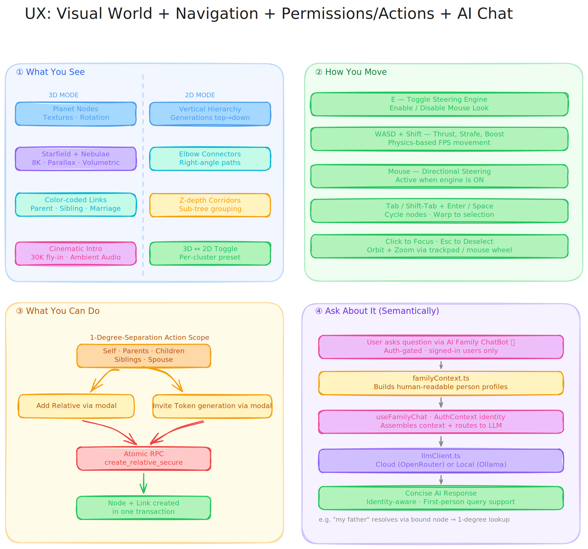

# Osra: 3D Family Tree Visualization

**Osra** is an interactive 3D & 2D family tree visualisation that transforms complex genealogical relationships into an immersive, explorable 3D space. Built with React, TypeScript, and Three.js, this app combines sexy real-time 3D graphics with Supabase-powered authentication and permission controls.

## Overview

My goal was to create a collaborative family tree platform where multiple family clusters can coexist and interconnect through marriage links, while ensuring each user can only view and edit their immediate family network (self, parents, children, siblings, and spouse). With a little bit of fun.

## System Architecture



The system architecture diagram above illustrates the complete flow from the browser-based React frontend through authentication, data management, and backend services to the 3D visualization and AI chat components.

<div style="display: flex; justify-content: center; gap: 1rem; flex-wrap: wrap;">
  
  
</div>

### The Flow

This project was built progressively, with each step unlocking the next capability.

1. **Started with the visualization challenge**: Family trees are networks, not hierarchies—we needed a layout that could handle complex interconnections, so we chose **force-directed graphs** where physics naturally clusters related nodes

2. **Added the third dimension**: Multiple family clusters were overlapping in 2D, so we moved to **3D space with react-force-graph-3d**, giving each cluster its own region and making marriage links visible as bridges

3. **Enabled collaboration**: A static visualization wasn't enough—we needed multiple family members to contribute, so we integrated **Supabase with Google OAuth** for easy sign-in and shared data storage

4. **Linked users to the tree**: Users needed identity within the tree, not just authentication, so we built the **node binding system** where each user account connects to exactly one family node

5. **Restricted edit permissions**: Everyone seeing everything was too open, so we implemented the **1-degree network rule**—users can only view/edit themselves, parents, children, siblings, and spouse

6. **Enforced permissions at database level**: Application-level checks could be bypassed, so we used **PostgreSQL RLS policies** with custom functions that validate graph relationships before allowing access

7. **Controlled tree growth**: Allowing anyone to create nodes would cause chaos, so we built the **invite token system** where existing members invite new ones to claim specific nodes

8. **Made relationships visually clear**: All links looked the same, so we **color-coded them**—parent (blue), sibling (green), marriage (red)—making the family structure instantly readable

9. **Made 3D navigation immersive**: Flying through 3D was disorienting, so we developed **Starship FPS-style controls**. With WASD for thrust and mouse-based steering, exploring the family tree feels like navigating a 3D universe.

Each solution unlocked the next challenge, building from a simple graph visualization into a fully collaborative, permission-controlled family tree platform.

## Features

### Family Chatbot
- **Floating assistant (🤖)**: Now with **User Identification**—the bot knows who is signed in and can answer personal questions like "Who is my father?". Uses person-centric context from your tree. BE EXTREMELY CONCISE responses.

### Core Functionality
- **3D Force-Directed Graph**: Physics-based layout using react-force-graph-3d.
- **Regional Background Grouping**: In Family Presets, connected background sub-trees are automatically grouped behind their anchors using a Z-axis spiral spread to prevent collisions.
- **Multi-Cluster Architecture**: Multiple family clusters spatially separated in 3D space.
- **Marriage Links**: Visual bridges connecting different family clusters.
- **Starship FPS Navigation**: Immersive mouse steering and WASD movement with fixed zoom/trackpad responsiveness.
- **Dynamic Node Interaction**: Click-to-focus and Tab-based node cycling with a glowing aura.
- **Planetary Textures**: Realistic 3D planet skins for nodes with continuous rotation and dynamic lighting.
- **Multi-Style Rendering**: Toggle between Planets, futuristic metallic Spheres, or simple Labels.
- **True 3D Starfield**: Immersive 8K backdrop with multi-layered parallax stars and galactic dust core.
- **Procedural Nebulae**: High-detail, volumetric gaseous clouds (Trifid and Helix styles) with organic motion.
- **Cinematic Intro Zoom**: Dramatic 30,000-unit "fly-in" from deep space upon app entry.
- **Ambient Cosmic Music**: Immersive background audio synced with the cinematic entry (default ON).
- **Celestial Body Mode**: Toggle links visibility to see family members as floating stars in deep space.
- **Clean UI**: Centralized selection panel and settings gear (⚙️) for an unobstructed view across 3D and 2D modes.
- **Landing (osra.cc)**: Scroll-driven 3D node graph hero, Meet Osra copy, 3-step How It Works, CTA.

### Navigation Controls
- **E**: Toggle Steering Engine (Enable/Disable Mouse Look)
- **WASD / Arrows**: Forward/Backward thrust and Strafe Left/Right
- **Shift**: Speed Boost
- **Tab / Shift-Tab**: Cycle through family members
- **Enter / Space**: Precision warp to selected node
- **Esc**: Deselect / Reset orientation
- **Mouse**: Directional steering (when engine is ON)

### Authentication & Permissions
- **Google OAuth Integration**: Seamless sign-in via Supabase Auth
- **Node Binding System**: Users bind to specific family tree nodes via invite tokens
- **Hardened 1-Degree Model**: Rebuilt security layer (RLS) that supports relatives and siblings
- **Atomic Operations**: Secure RPC functions (`create_relative_secure`) for data integrity
- **Role-Based Access**: Admin role for full tree management

### Relationship Types
- **Parent Links**: Vertical family structure
- **Sibling Links**: Horizontal connections within generations
- **Marriage Links**: Cross-cluster connections with distinct visual styling

## Tech Stack

### Frontend
- **React 18** + **TypeScript**: Type-safe component architecture
- **Material UI (MUI)**: Buttons, Switches, theme (`src/theme/osraTheme.ts`). Tree app UI uses MUI + react-spring for expandable panels.
- **react-force-graph-3d**: Three.js wrapper for 3D force-directed graphs
- **Three.js/WebGL**: Hardware-accelerated 3D rendering
- **Framer Motion**: Smooth UI animations for chat and landing page
- **React Markdown**: Rendering structured AI responses
- **React Router**: Client-side routing for invite links and pages
- **Vite**: Fast development server and optimized builds

### AI & LLM
- **OpenRouter**: Cloud-based LLM access (Gemini 3 Flash)
- **Ollama**: Local LLM support (Qwen 2.5 Coder / Mistral)
- **Custom Reasoning Engine**: Person-centric context generation from graph data

### Backend & Database
- **Supabase**: PostgreSQL database with real-time subscriptions
- **Supabase Auth**: Google OAuth provider integration
- **Row-Level Security (RLS)**: Postgres policies enforcing 1-degree permissions
- **Custom Functions**: `is_within_1_degree()` and `is_admin()` helpers

### Deployment
- **Vercel**: Automatic deployment from main branch

## Project Structure

```
src/
├── components/
│   ├── FamilyTree3D.tsx          # Main 3D visualization component
│   ├── FamilyChat.tsx            # AI Chatbot UI component
│   ├── modals/                   # AddRelative, EditNode, BulkInvite modals
│   └── landing/                  # Landing page (osra.cc)
│       ├── LandingPage.tsx       # Orchestrator, hero track, spacers
│       ├── MeetOsraHero.tsx      # Scroll-driven 3D node graph
│       ├── HowItWorks.tsx        # 3-step section
│       └── HangarTransition.tsx  # CTA
├── contexts/
│   └── AuthContext.tsx           # Authentication state management
├── hooks/
│   ├── useFamilyData.ts          # Family tree data fetching logic
│   └── useFamilyChat.ts          # Chatbot logic and LLM orchestration
├── lib/
│   ├── supabase.ts               # Supabase client configuration
│   └── permissions.ts            # 1-degree permission helpers
├── utils/
│   ├── llmClient.ts              # OpenRouter/Ollama dual-mode client
│   └── familyContext.ts          # Graph-to-profile context generator
├── pages/
│   ├── HomePage.tsx              # Landing or tree (auth-gated)
│   └── InvitePage.tsx            # Invite token claim page
├── types/
│   ├── database.ts               # Supabase generated types
│   └── graph.ts                  # Graph data structures
├── App.tsx                       # Route definitions
└── main.tsx                      # Application entry point
supabase/
│   ├── migrations/               # Schema, RLS, functions (run in order)
│   ├── seed/                     # Seed data (run in SQL Editor)
│   │   ├── bulk-upload-1-seed.sql     # Base family tree data
│   │   ├── bulk-upload-2-badran.sql    # Additional Badran nodes 75–309
│   │   ├── bulk-upload-2-badran.json   # Source JSON for Badran additions
│   │   └── bulk-upload-2-badran-undo.sql  # Revert Badran additions
│   └── reference/                # Reference SQL (not run directly)
│       ├── policies.sql          # RLS policies
│       └── public-metrics.sql    # get_public_metrics RPC
```

## Getting Started

### Prerequisites
- Node.js 18+
- npm or pnpm
- Supabase account with Google OAuth configured

### Installation

1. Clone the repository:

```bash
git clone <repository-url>
cd 3d-family-tree
```

2. Install dependencies:

```bash
npm install
```

3. Create a `.env.local` file with your **development** Supabase credentials (copy from `.env.example`):

```bash
VITE_SUPABASE_URL=https://your-dev-project.supabase.co
VITE_SUPABASE_ANON_KEY=your_dev_anon_key
```

   **Important:** Use your dev project credentials for local development so `npm run dev` does not write to production. See [docs/DEV_VS_PROD_DATABASE.md](docs/DEV_VS_PROD_DATABASE.md) for full setup.

4. Run the development server:

```bash
npm run dev
```

### Database Setup

1. Apply migrations and seed data in your Supabase SQL Editor (or via Supabase CLI):

   - Run migrations in `supabase/migrations/` in order (schema, RLS policies, indexes, etc.)
   - See `supabase/reference/policies.sql` for policy reference (policies are applied via migrations)
   - Optionally run `supabase/seed/bulk-upload-1-seed.sql` for sample family tree data

2. Configure Google OAuth in Supabase Dashboard:
   - Navigate to Authentication > Providers
   - Enable Google provider
   - Add your OAuth credentials
   - Set redirect URL to your app domain

## Development Workflow

### Local Development

```bash
npm run dev              # Start dev server at http://localhost:5173
npm run build            # Production build
npm run preview          # Preview production build locally
npm run lint             # Run ESLint
```

### Working with Supabase

The project uses Supabase for authentication, data storage, and real-time updates. Key database tables:

- **users**: OAuth user profiles with role and node_id binding
- **nodes**: Family tree nodes (people) with metadata
- **links**: Relationships between nodes (parent, sibling, marriage)
- **node_invites**: Invite tokens for node binding

### Permission Model

The 1-degree network model ensures users can only interact with:
- **Self**: Their own bound node
- **Parents**: Direct parent links
- **Children**: Direct child links
- **Siblings**: Nodes sharing at least one parent
- **Spouse**: Marriage link connections

This is enforced through:
1. RLS policies on tables (database-level)
2. `is_within_1_degree()` helper function (validates node access)
3. Frontend guards (prevents UI exposure of unauthorized data)

## Deployment

The project is configured for automatic deployment on Vercel:

1. Push to the `main` branch
2. Vercel automatically builds and deploys
3. Environment variables are configured in Vercel dashboard

## Key Concepts

### Force-Directed Layout
The graph uses physics simulation to position nodes—connected nodes attract, while all nodes repel each other slightly. This creates natural clustering of family groups while maintaining readability.

### Starship Navigation
The app uses a frame-based movement loop. The camera's "look direction" is driven by mouse position (steering), and movement is relative to that view. This allows users to "fly" through the clusters, maintaining a constant sense of presence in the family network.

### Node Binding
Users must be "bound" to a specific node in the tree to gain access. This binding:
1. Establishes the user's identity within the family tree
2. Determines which nodes/links they can access (1-degree network)
3. Enables personalized navigation (e.g., "center on my node")

### Invite System
The tree follows a "distributed ownership" model - you can only "grow" the parts you're actually related to.

Admins or existing family members can generate invite tokens for specific nodes. New users claim these tokens to bind their account, ensuring controlled onboarding and maintaining data integrity.

## [FB Notes]_ai

**Phase 1: Visualization**
We needed **A) a 3D graph**, **B) family clusters that don't overlap**, and **C) clear relationship types**.  
- **A = react-force-graph-3d** so we could lay out nodes with physics and navigate in 3D.  
- **B = family_cluster + spatial separation** so each family sits in its own region and marriage links show as bridges.  
- **C = Color-coded links** (parent, sibling, marriage) so the structure is readable at a glance.

**Phase 2: Auth and identity**
We needed **D) sign-in** and **E) a way to tie users to specific nodes**.  
- **D = Supabase + Google OAuth** so family members can sign in without managing passwords.  
- **E = Node binding** so each user is "this person in the tree" and we know their 1-degree network.

**Phase 3: Invites and production hardening**
We needed **F) controlled onboarding** and **G) no silent failures**.  
- **F = Invite tokens** so only people with a link can claim a node and get access.  
- **G = Secure Database Transactions** so claiming does validation + user creation + marking tokens as used in one go — ensuring the UI never says "success" if the data didn't save.

**Phase 4 & 5: Growth, Security, and Navigation**
We completed the core pillars of the 3D bridge:
- **What**: Integrated full "Add Relative" and "Bulk Invite" systems with FPS-style "Starship" keyboard navigation.
- **Why**: To allow the tree to grow securely from within, while making exploration feel like a high-fidelity 3D game.
- **How**: 
  - Built **Atomic Database Operations** to ensure node and link creation never fail partially.
  - Implemented a **Hardened Security Model** to prevent unauthorized data changes.
  - Developed a **Frame-based Navigation Loop** with WASD thrust, Shift-boost, and an "Engine Toggle" for precise steering.

**The architecture decision**
We use **direct data fetching** for core operations. This bypasses potential websocket bottlenecks and ensures the app remains snappy and reliable.

**The flow**
1. **Invite claim**: User validates a token → signs in with Google → DB securely creates the user record and marks the token as used in a single step.
2. **Loading the tree**: Authenticated requests fetch nodes and links; the database ensures you only see what you're permitted to.
3. **Adding Relatives**: Members add relatives directly from the 3D view, with the database handling node and link creation simultaneously.

**Phase 6: Presets & Hierarchical Views**
We needed **H) classic tree readability** and **I) clean visual paths**.
- **H = Family Presets (2D)** so users can toggle a cluster into a clean vertical hierarchy with parents at the top and children below. 
- **I = Orthogonal "Elbow" Connectors** so parent-child links follow clean right-angle paths instead of crossing lines, making generations easy to trace.

**Key learnings**
- **3D Focus**: Moving unrelated nodes to a distant background plane allows the active family cluster to "pop" into a 2D view without losing the wider context.
- **Custom Rendering**: Fine-grained control over link positioning is essential for non-straight geometries like elbow connectors.
- **Dynamic Leveling**: Using smart traversal algorithms allows us to calculate generation levels on-the-fly without storing fixed coordinates.

**Phase 8: AI Intelligence & Visual Fidelity**
We completed the "Brain and Beauty" upgrade:
- **The Brain**: Implemented an AI Chat Bot that understands family relationships.
    - **Strategy**: Instead of sending raw data IDs, we pre-process the graph into human-readable "Person Profiles." This allows the AI to accurately trace complex maternal and paternal lineages.
    - **Dual-Mode**: Users can toggle between Cloud and Local AI models.
- **The Face**: Upgraded nodes to "Planets."
    - **Visuals**: Added realistic textures, improved lighting, and a starfield background.
    - **Bug Fix**: Isolated node rotation to the mesh level, ensuring smooth and accurate dragging interactions.

**Phase 9: Immersive Starfield & UI Refinement**
We completed the "Infinity and Beyond" upgrade:
- **Infinity**: Implemented a true 3D Starfield backdrop with multi-layered parallax.
    - **Visuals**: Added a distant background sphere with `stars.jpg` and a volumetric particle layer for near/mid parallax.
    - **Optimization**: Switched to `toneMapped: false` for all star materials to maintain high intensity and "pop" against the deep space background.
- **Beyond**: Added a "Celestial Body" mode and a clean UI system.
    - **Features**: A new "Links: ON/OFF" toggle allows nodes to appear as floating stars without visible connection lines.
    - **UI**: Added a settings gear (⚙️) to hide the top-right controls for a cinematic, unobstructed view of the tree.
- **Bug Fix**: Resolved a "massive red sphere" overlap at the origin by boosting initial simulation repulsion and energy.

**Phase 10: The Immersive Deep Space Experience**
We completed the "Cosmic Cinematic" upgrade:
- **Nebulae**: Added procedural, multi-colored gaseous nebulae.
- **8K Visuals**: Upgraded the environment to an 8K Starfield background.
- **Cinematics**: Built a synchronized Intro experience with 30,000-unit fly-in and audio.

**Phase 11: OSRA Rebranding & Spatial Intelligence**
We completed the "Osra Refinement" cycle:
- **Branding**: App renamed to **Osra** with cursive bold styling in loading states.
- **Spatial Intelligence**: Implemented **Regional Background Grouping** in 3D presets. Whole background sub-trees now follow their anchors into Z-depth "corridors" using a spiral anti-collision layout.
- **AI Personalization**: Chatbot now identifies the signed-in user for first-person queries ("my cousins") and provides extremely concise answers.
- **UI Consolidation**: Centralized selection UI in `FamilyTree.tsx` to fix overlaps and sync behavior (Collapse All, Double-Click) across 3D and 2D views.
- **Control Sync**: Fixed zoom/trackpad responsiveness by updating `OrbitControls` in the navigation loop.

**Phase 12: Security & UI Hardening**
We completed the "Safety First" security cycle:
- **One-Time Invites**: Implemented automatic invalidation of existing unclaimed invites when generating new ones.
- **Identity Verification**: Added a confirmation screen for invitees ("Is this you?") with a soft "Alrighty then!" rejection flow to prevent accidental claims.
- **Chatbot Gating**: Moved the Family Chat Bot inside the authenticated `FamilyTree` component, ensuring it is hidden from uninvited strangers and during initial loading.
- **Hardened Sign-Out**: Fixed a session persistence bug by forcing `prompt: select_account` on Google sign-in and implementing a hard redirect on sign-out.
- **Cleanup**: Centralized all node-selection UI and modals to prevent visual overlaps.

**Phase 13: Osra Landing Page**
Scroll-driven 3D node graph hero (1000vh sticky), Meet Osra copy, 3-step How It Works, CTA. Lora, purple accents, #07030f.

**High-Level Learnings**
- **Context is King**: Pre-processing data into human-readable formats is more effective for AI accuracy than simply using larger models.
- **Centralized Animation**: High-performance 3D requires a single centralized loop to maintain a smooth frame rate as the network grows.
- **Living History**: Immersive navigation and AI assistance transform a static database into an explorable family legacy.
- **Friction as a Feature**: Strategic confirmation steps (like the "Is this you?" screen) provide essential security without sacrificing a premium user experience.
