# 3D Family Tree Visualization

An interactive 3D family tree visualization that transforms complex genealogical relationships into an immersive, explorable 3D space. Built with React, TypeScript, and Three.js, this application combines real-time 3D graphics with Supabase-powered authentication and fine-grained permission controls.

## Overview

The goal is to create a collaborative family tree platform where multiple family clusters can coexist and interconnect through marriage links, while ensuring each user can only view and edit their immediate family network (1-degree relatives: self, parents, children, siblings, and spouse).

## Building Story

This project was built progressively, with each step unlocking the next capability:

```mermaid
flowchart TD
    A[🎯 Goal: Visualize complex family relationships] --> B[📋 Need: Network-like structure with natural clustering]
    B --> C[✅ Solution: Force-directed graphs with physics simulation]
    C --> D[📋 Need: 3D space to separate family clusters]
    D --> E[✅ Solution: react-force-graph-3d with Three.js/WebGL]
    E --> F[📋 Need: Multiple users to collaborate on the tree]
    F --> G[✅ Solution: Supabase database + Google OAuth]
    G --> H[📋 Need: Users to only edit their immediate family]
    H --> I[✅ Solution: Node binding system - each user bound to one node]
    I --> J[📋 Need: Enforce 1-degree network permissions]
    J --> K[✅ Solution: PostgreSQL RLS policies with is_within_1_degree function]
    K --> L[📋 Need: Controlled onboarding without duplicates]
    L --> M[✅ Solution: Invite token system for node claiming]
    M --> N[📋 Need: Visual distinction between relationship types]
    N --> O[✅ Solution: Color-coded links - parent blue, sibling green, marriage red]
    O --> P[📋 Need: Intuitive navigation in 3D space]
    P --> Q[✅ Solution: Google Earth-style orbit controls + click-to-focus]
    Q --> R[🎉 Result: Multi-user 3D family tree with privacy controls]

    style A fill:#e1f5ff,stroke:#0066cc,stroke-width:2px
    style R fill:#d4edda,stroke:#28a745,stroke-width:2px
    style C fill:#fff3cd,stroke:#ffc107,stroke-width:2px
    style E fill:#fff3cd,stroke:#ffc107,stroke-width:2px
    style G fill:#fff3cd,stroke:#ffc107,stroke-width:2px
    style I fill:#fff3cd,stroke:#ffc107,stroke-width:2px
    style K fill:#fff3cd,stroke:#ffc107,stroke-width:2px
    style M fill:#fff3cd,stroke:#ffc107,stroke-width:2px
    style O fill:#fff3cd,stroke:#ffc107,stroke-width:2px
    style Q fill:#fff3cd,stroke:#ffc107,stroke-width:2px
```



### The Flow

1. **Started with the visualization challenge**: Family trees are networks, not hierarchies—we needed a layout that could handle complex interconnections, so we chose **force-directed graphs** where physics naturally clusters related nodes

2. **Added the third dimension**: Multiple family clusters were overlapping in 2D, so we moved to **3D space with react-force-graph-3d**, giving each cluster its own region and making marriage links visible as bridges

3. **Enabled collaboration**: A static visualization wasn't enough—we needed multiple family members to contribute, so we integrated **Supabase with Google OAuth** for easy sign-in and shared data storage

4. **Linked users to the tree**: Users needed identity within the tree, not just authentication, so we built the **node binding system** where each user account connects to exactly one family node

5. **Restricted edit permissions**: Everyone seeing everything was too open, so we implemented the **1-degree network rule**—users can only view/edit themselves, parents, children, siblings, and spouse

6. **Enforced permissions at database level**: Application-level checks could be bypassed, so we used **PostgreSQL RLS policies** with custom functions that validate graph relationships before allowing access

7. **Controlled tree growth**: Allowing anyone to create nodes would cause chaos, so we built the **invite token system** where existing members invite new ones to claim specific nodes

8. **Made relationships visually clear**: All links looked the same, so we **color-coded them**—parent (blue), sibling (green), marriage (red)—making the family structure instantly readable

9. **Made 3D navigation intuitive**: Flying through 3D was disorienting, so we added **Google Earth-style controls** with smooth orbiting and click-to-focus centering

Each solution unlocked the next challenge, building from a simple graph visualization into a fully collaborative, permission-controlled family tree platform.

## Features

### Core Functionality
- **3D Force-Directed Graph**: Physics-based layout using react-force-graph-3d
- **Multi-Cluster Architecture**: Multiple family clusters spatially separated in 3D space
- **Marriage Links**: Visual bridges connecting different family clusters
- **Google Earth-style Navigation**: Intuitive orbit, zoom, pan, and click-to-focus controls
- **Node Metadata Display**: Name, birth date, birth place, and relationship information

### Authentication & Permissions
- **Google OAuth Integration**: Seamless sign-in via Supabase Auth
- **Node Binding System**: Users bind to specific family tree nodes via invite tokens
- **1-Degree Network Permissions**: Users can only view/edit their immediate relatives (self, parents, children, siblings, spouse)
- **Role-Based Access**: Admin role for full tree management
- **Row-Level Security**: Database-enforced permissions via Supabase RLS policies

### Relationship Types
- **Parent Links**: Vertical family structure
- **Sibling Links**: Horizontal connections within generations
- **Marriage Links**: Cross-cluster connections with distinct visual styling

## Tech Stack

### Frontend
- **React 18** + **TypeScript**: Type-safe component architecture
- **react-force-graph-3d**: Three.js wrapper for 3D force-directed graphs
- **Three.js/WebGL**: Hardware-accelerated 3D rendering
- **React Router**: Client-side routing for invite links and pages
- **Vite**: Fast development server and optimized builds

### Backend & Database
- **Supabase**: PostgreSQL database with real-time subscriptions
- **Supabase Auth**: Google OAuth provider integration
- **Row-Level Security (RLS)**: Postgres policies enforcing 1-degree permissions
- **Custom Functions**: `is_within_1_degree()` and `is_admin()` helpers

### Deployment
- **Vercel**: Automatic deployment from main branch

## Project Structure

```
src/
├── components/
│   └── FamilyTree3D.tsx          # Main 3D visualization component
├── contexts/
│   └── AuthContext.tsx           # Authentication state management
├── hooks/
│   └── useFamilyData.ts          # Family tree data fetching logic
├── lib/
│   └── supabase.ts               # Supabase client configuration
├── pages/
│   ├── HomePage.tsx              # Main tree visualization page
│   └── InvitePage.tsx            # Invite token claim page
├── types/
│   ├── database.ts               # Supabase generated types
│   └── graph.ts                  # Graph data structures
├── App.tsx                       # Route definitions
└── main.tsx                      # Application entry point

supabase-policies.sql             # RLS policies and helper functions
supabase-seed.sql                 # Sample family tree data
```

## Getting Started

### Prerequisites
- Node.js 18+
- npm or pnpm
- Supabase account with Google OAuth configured

### Installation

1. Clone the repository:

```bash
git clone <repository-url>
cd 3d-family-tree
```

2. Install dependencies:

```bash
npm install
```

3. Create a `.env.local` file with your Supabase credentials:

```bash
VITE_SUPABASE_URL=your_supabase_url
VITE_SUPABASE_ANON_KEY=your_supabase_anon_key
```

4. Run the development server:

```bash
npm run dev
```

### Database Setup

1. Run the schema and RLS policies in your Supabase SQL Editor:

```bash
# Apply the RLS policies
supabase-policies.sql

# (Optional) Seed with sample data
supabase-seed.sql
```

2. Configure Google OAuth in Supabase Dashboard:
   - Navigate to Authentication > Providers
   - Enable Google provider
   - Add your OAuth credentials
   - Set redirect URL to your app domain

## Development Workflow

### Local Development

```bash
npm run dev              # Start dev server at http://localhost:5173
npm run build            # Production build
npm run preview          # Preview production build locally
npm run lint             # Run ESLint
```

### Working with Supabase

The project uses Supabase for authentication, data storage, and real-time updates. Key database tables:

- **users**: OAuth user profiles with role and node_id binding
- **nodes**: Family tree nodes (people) with metadata
- **links**: Relationships between nodes (parent, sibling, marriage)
- **node_invites**: Invite tokens for node binding

### Permission Model

The 1-degree network model ensures users can only interact with:
- **Self**: Their own bound node
- **Parents**: Direct parent links
- **Children**: Direct child links
- **Siblings**: Nodes sharing at least one parent
- **Spouse**: Marriage link connections

This is enforced through:
1. RLS policies on tables (database-level)
2. `is_within_1_degree()` helper function (validates node access)
3. Frontend guards (prevents UI exposure of unauthorized data)

## Deployment

The project is configured for automatic deployment on Vercel:

1. Push to the `main` branch
2. Vercel automatically builds and deploys
3. Environment variables are configured in Vercel dashboard

## Key Concepts

### Force-Directed Layout
The graph uses physics simulation to position nodes—connected nodes attract, while all nodes repel each other slightly. This creates natural clustering of family groups while maintaining readability.

### Spatial Separation
Family clusters start at different positions in 3D space (controlled by `family_cluster` field), preventing overlap and making inter-cluster marriage links visually prominent.

### Node Binding
Users must be "bound" to a specific node in the tree to gain access. This binding:
1. Establishes the user's identity within the family tree
2. Determines which nodes/links they can access (1-degree network)
3. Enables personalized navigation (e.g., "center on my node")

### Invite System
Admins or existing family members can generate invite tokens for specific nodes. New users claim these tokens to bind their account, ensuring controlled onboarding and maintaining data integrity.

## [FB Notes]_ai

**Key Technical Decisions:**

The force-directed graph physics runs at 60 FPS in the browser using Three.js WebGL rendering, with node repulsion and link attraction creating natural clustering without manual positioning. Each family cluster starts at a different position in 3D space (using `family_cluster` field), preventing overlap and making cross-cluster marriage links visually prominent as bridges.

The permission model uses graph traversal at the database level—`is_within_1_degree()` checks if two nodes share a parent (siblings), have a direct parent/child link, or are connected by marriage. This runs in PostgreSQL using recursive queries before any data leaves the database, providing defense-in-depth security even if the frontend is compromised.

Node binding creates a one-to-one mapping between auth users and tree nodes, solving the identity problem—users aren't just "authenticated," they're "authenticated as this specific person in the tree." The invite token system enforces this mapping, preventing duplicate nodes and ensuring controlled tree growth.

The spatial separation in 3D gives each family cluster ~500 units of separation on the XY plane, enough that force-directed repulsion doesn't pull them together, while marriage links (drawn in red) span these distances as visible bridges. The Google Earth-style controls (implemented via react-force-graph-3d's camera controls) make navigation feel natural—orbit to explore, click to center, zoom to focus.

**What Makes This Work:**
- Physics simulation scales to hundreds of nodes without performance degradation (GPU-accelerated)
- RLS policies validate every database operation, not just read queries—inserts/updates/deletes all check `is_within_1_degree()`
- The 1-degree network creates "distributed ownership"—no single user controls the whole tree, but everyone can curate their immediate family
- Invite tokens are single-use and expire, preventing unauthorized access while enabling gradual family onboarding

This architecture transforms family tree creation from a single-author document into a collaborative graph database where privacy and permissions emerge naturally from the relationship structure itself.
