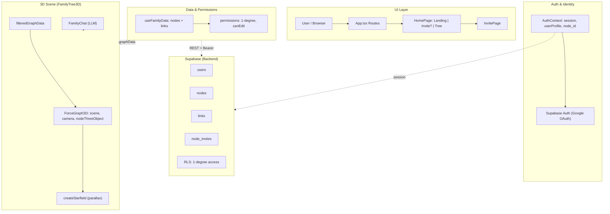

# 3D Family Tree — How It Works

High-level architecture of the app: UI → Auth → Data & permissions → Supabase backend → 3D scene.

## Diagram (Mermaid)

## Notes

- **Invite flow**: User claims invite token → `users.node_id` is set. RLS filters `nodes` and `links` by 1-degree access.
- **3D scene**: `FamilyTree3D` uses `ForceGraph3D`, `createStarfield` (parallax), `filteredGraphData`, and `FamilyChat` (LLM).

## Excalidraw source

The same diagram is stored as Excalidraw-style JSON in this repo:  
[`docs/3d-family-tree-architecture.excalidraw.json`](./3d-family-tree-architecture.excalidraw.json)  
(Checkpoint id from Cursor Excalidraw MCP: `ada2b498a5674157b1`.)
