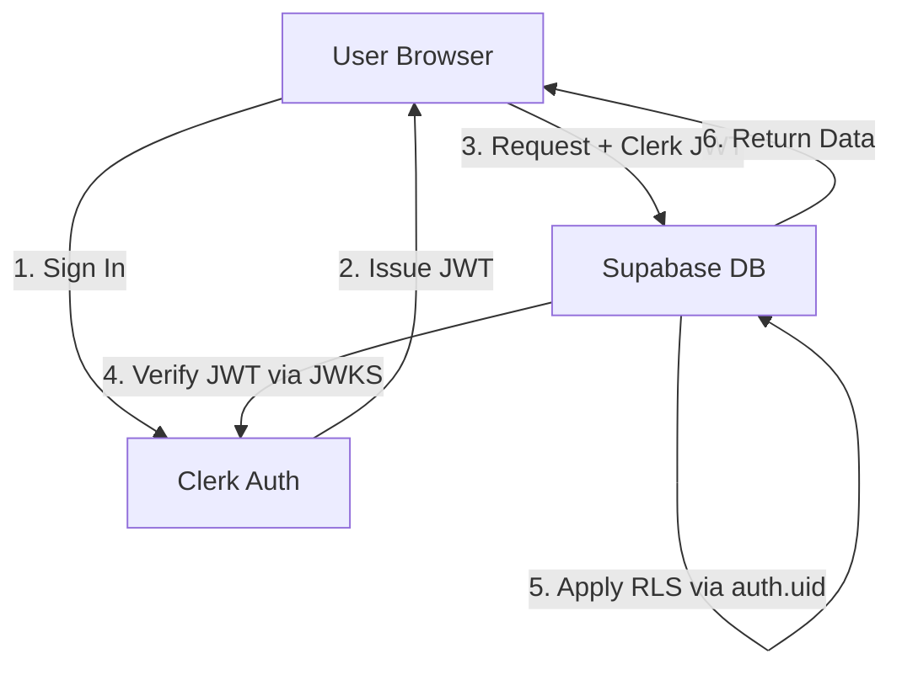

# Design: Migrating to Clerk Auth (OIDC Wrapper)

## Overview
Osra currently uses Supabase Auth, which exposes a non-professional Supabase URL during the sign-in flow and requires a paid tier ($35/mo) for custom domains. We are migrating to **Clerk** for authentication while keeping **Supabase** for the database, leveraging Supabase's **Third-Party Auth (OIDC)** and **Clerk Foreign Data Wrapper (clerk_fdw)**.

This design provides a professional, custom-branded auth experience on a free tier while maintaining powerful Row Level Security (RLS) policies.

## Goals
- **Professional UX**: Use Clerk's `<SignIn />` and `<SignUp />` components on a custom domain (e.g., `auth.osra.app`) for $0.
- **Zero Cost**: Stay on the free tiers of both Clerk and Supabase.
- **Minimal RLS Impact**: Continue using `auth.uid()` in Supabase policies.
- **Unified Profile**: Maintain a `public.users` table in Supabase that is kept in sync with Clerk data.

## Architecture

### 1. Authentication Flow (OIDC)
Supabase will be configured as an OIDC consumer, trusting JWTs issued by Clerk.



- **JWT Configuration**: We will set Clerk's JWKS URL and Issuer in the Supabase Auth settings.
- **User Identity**: The `sub` claim in the Clerk JWT (the user ID, e.g., `user_2...`) will be mapped to `auth.uid()` in Supabase.

### 2. Database Sync (Clerk Wrapper)
The user has enabled the `clerk_fdw` extension on Supabase. We will use this to synchronize our `public.users` table.

- **Foreign Table**: Define `clerk_users` as a foreign table in the `clerk` schema.
- **Sync Strategy**: 
    - **Backfill**: Use a SQL script to `INSERT INTO public.users SELECT * FROM clerk_users` for existing users.
    - **Reactivity**: We will still use a **Clerk Webhook** (`user.created`, `user.updated`) for real-time updates to `public.users`. The `clerk_fdw` serves as a fallback and administrative tool.

## Schema Changes

### 1. ID Type Migration
Clerk user IDs are strings (`TEXT`), not `UUID`s. We must migrate our entire schema to accommodate this.

- **`public.users`**:
    - `id`: `UUID` -> `TEXT`
- **`public.nodes`**:
    - `created_by_user_id`: `UUID` -> `TEXT`
- **`public.links`**:
    - `created_by_user_id`: `UUID` -> `TEXT`
- **`public.node_invites`**:
    - `claimed_by_user_id`: `UUID` -> `TEXT` (if applicable)

### 2. RLS Policy Updates
Most RLS policies using `(id = (select auth.uid()))` will continue to work, provided the types match. We will verify each policy during the migration.

## Frontend Changes

### 1. Authentication Provider
- Install `@clerk/clerk-react`.
- Replace `AuthContext.tsx` logic with Clerk's `useUser()` and `useSession()`.
- Implement a custom `fetch` wrapper for the Supabase client to inject the Clerk JWT:
    ```typescript
    const token = await session.getToken({ template: 'supabase' });
    ```

### 2. Protected Routes
- Wrap the app in `<ClerkProvider />`.
- Use `<SignedIn />` and `<SignedOut />` for landing page gating.

## Implementation Phases

1.  **Phase 1: Database Migration**: Update ID columns from `UUID` to `TEXT` and handle foreign key constraints.
2.  **Phase 2: Supabase Configuration**: Set up OIDC (Clerk JWKS) and Clerk Foreign Data Wrapper.
3.  **Phase 3: Webhook Setup**: Create a Supabase Edge Function to listen for Clerk `user.*` events.
4.  **Phase 4: Frontend Migration**: Swap Supabase Auth for Clerk React components and update the Supabase client.
5.  **Phase 5: Cleanup**: Remove unused Supabase Auth configurations and code.

## Success Criteria
- [ ] Users can sign in via Clerk on the custom/pretty domain.
- [ ] New users are automatically created in the `public.users` table via webhook.
- [ ] Row Level Security correctly filters data based on the Clerk User ID.
- [ ] The 3D family tree renders and updates correctly with the new auth context.
